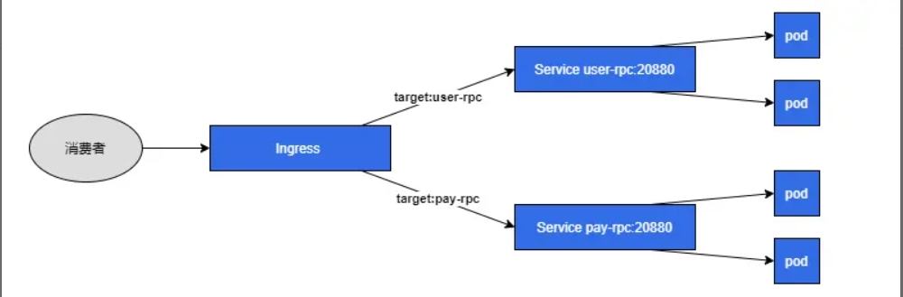
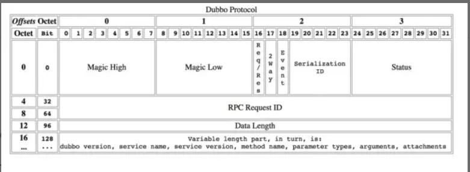

### dubbo 四层网关
dubbo 消费者请求统一经过网关，网关根据目标提供者application.name作为虚拟 host 进行转发，以复用同一端口，降低手动管理 dubbo 提供者服务端口的复杂度。



### 背景
>由于公司内部所有服务都是跑在阿里云 k8s 上的，如果我们本地开发需要访问 k8s 内的 dubbo 提供者服务的话，需要手动通过k8s service把服务暴露到外网，我们的做法是针对每一个提供者服务暴露一个SLB IP+自定义端口，并且通过 dubbo 提供的DUBBO_IP_TO_REGISTRY和DUBBO_PORT_TO_REGISTRY环境变量来把对应的SLB IP+自定义端口注册到注册中心里，可是好景不长，当 dubbo 提供者服务越来越多时，会发现这种方式管理起来会带来不小的麻烦。
>能不能像nginx一样实现一个七层负载，通过目标提供者的application.name来做对应的转发,host为 dubbo 提供者的application.name  backend.serviceName和backend.servicePort是 dubbo 提供者服务暴露的service
>消费者添加自定义 Filter 由于默认请求下，dubbo 请求不会携带目标提供者的application.name，为此我特意向 dubbo 官方提了个issue，那边提供的建议是通过自定义Filter来实现，附代码：

## dubbo 协议

> 可以看到 dubbo 协议的 header 是固定的16个字节，里面并没有类似于 HTTP Header 的可扩展字段，也没有携带目标提供者的application.name字段，于是我向官方提了个issue，官方的答复是通过消费者自定义Filter来将目标提供者的application.name放到attachments里，这里不得不吐槽下 dubbo 协议，扩展字段竟然是放在body里，如果要实现转发需要把请求报文全部解析完才能拿到想要报文。


### 4. 消费者添加自定义 Filter

由于默认请求下，dubbo 请求不会携带目标提供者的`application.name`， dubbo官方[issue](https://github.com/apache/dubbo/issues/9251)，那边提供的建议是通过`自定义Filter`来实现，附代码：

```java
import static org.apache.dubbo.common.constants.CommonConstants.CONSUMER;

import org.apache.dubbo.common.extension.Activate;
import org.apache.dubbo.common.utils.StringUtils;
import org.apache.dubbo.rpc.Filter;
import org.apache.dubbo.rpc.Invocation;
import org.apache.dubbo.rpc.Invoker;
import org.apache.dubbo.rpc.Result;
import org.apache.dubbo.rpc.RpcException;


@Activate(group = CONSUMER)
public class AddTargetFilter implements Filter {

  @Override
  public Result invoke(Invoker<?> invoker, Invocation invocation) throws RpcException {
    String targetApplication = StringUtils.isBlank(invoker.getUrl().getRemoteApplication()) ?
        invoker.getUrl().getGroup() : invoker.getUrl().getRemoteApplication();
    invocation.setAttachment("target-application", targetApplication);
    return invoker.invoke(invocation);
  }
}
```

添加`dubbo SPI`配置文件`META-INF/dubbo/org.apache.dubbo.rpc.Filter`，配置该 Filter。
